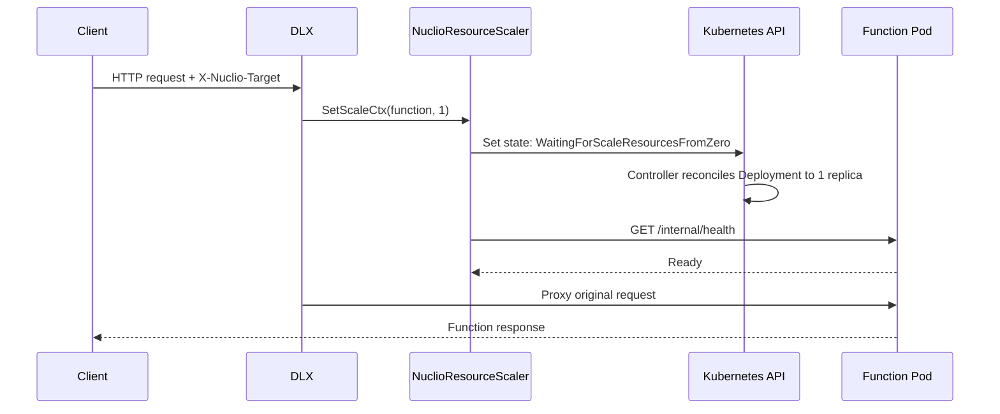

# Node-RED Nuclio

Deploy and invoke [Nuclio](https://nuclio.io/) functions from Node-RED.

The package provides two primary nodes:

| Node | Purpose |
| --- | --- |
| **Nuclio Function** | Owns a function's source, configuration, deployment, and health reconciliation. |
| **Nuclio Invoke** | Sends messages to a deployed function and exposes lifecycle commands. |

Functions can be written as Python, Go, Node.js, or Shell handlers. They can run from inline
source code, a container image, a Git repository, or an archive URL.

## Requirements

- Node.js 22 or newer
- Node-RED 4.0.0 or newer
- A reachable Nuclio dashboard

The dashboard does not need to be public, but the Node-RED process must be able to reach it.
Configure Nuclio authentication and permissions separately when the dashboard is protected.

## Install

Install the package in your Node-RED user directory:

```bash
npm install @bea.steers/node-red-contrib-nuclio
```

Restart Node-RED, then add a **Nuclio Server**, **Nuclio Project**, **Nuclio Function**, and
**Nuclio Invoke** node from the editor.

## Quick start

1. Create a **Nuclio Server** config node and enter the dashboard address.
2. Optionally create a **Nuclio Project** and attach it to the function. Projects are the
   ownership and status-isolation boundary for functions.
3. Create a **Nuclio Function**, choose a runtime, and enter the handler source or external
   source location.
4. Connect a **Nuclio Invoke** node to the function and deploy the flow.
5. Send messages to the invoke node. Successful invocations leave through output 1; invocation
   failures leave through output 2.

Functions deploy eagerly on Node-RED startup by default. Set **Deployment mode** to **Lazy** if
a function should not be created until a flow explicitly sends a `deploy` command.

## Runnable examples

Focused, repository-local Compose scenarios live under [`examples/`](examples/). Start them with
the architecture-aware [`examples/run-compose.sh`](examples/run-compose.sh); its README describes
the HTTP, cron, batching, MQTT, native NATS, and NATS/MQTT bridge paths.

The root `docker-compose.yml` remains the comprehensive local gallery. The disposable Kubernetes
canary is maintainer tooling under [`hack/kind/`](hack/kind/), not a user-facing example.

## Function sources

The Function tab supports these source types:

- **Source code**: code entered in the editor.
- **Image**: an existing container image.
- **Git**: a repository and optional branch, tag, reference, credentials, and work directory.
- **Archive**: a downloadable source archive.
- **Advanced configuration**: source fields controlled entirely by the YAML configuration.

Source fields in the editor override matching source fields in the YAML configuration. For Git
and archive sources, the Nuclio builder—not Node-RED—downloads the source, so the builder must
be able to reach the repository or URL.

## Configuration

### Server settings

Dashboard connection, deployment policy, invocation routing, and shared operational settings live
on the **Nuclio Server** node.

#### Dashboard connection and access

| Setting | Default | Description |
| --- | --- | --- |
| Dashboard URL | `NUCLIO_ADDRESS` | Address reachable by Node-RED. |
| Namespace | `nuclio` | Namespace sent with dashboard requests. |
| Dashboard URL for editor links | `http://localhost:8070` | Optional address used only for Dashboard links in the editor. |
| Dashboard authentication | `none` | Optional Basic or Bearer authentication for dashboard requests. |
| Dashboard request headers | blank | Additional credential-backed headers sent with every dashboard request. |

#### Deployment policy

| Setting | Default | Description |
| --- | --- | --- |
| Deployment policy | `managed` | Set to `disabled` to prevent creates, updates, and self-healing. Existing functions are left untouched. |

#### Invocation routing

| Setting | Default | Description |
| --- | --- | --- |
| Invocation source | `service` | Use a stable service hostname or a Nuclio-reported internal/external URL. |
| Service hostname template | `nuclio-{function}` | Stable function hostname. Docker Compose commonly uses `nuclio-nuclio-{function}`. |
| External URL protocol | `https` | Protocol for scheme-less external URLs. |

#### Operations (advanced)

| Setting | Default | Description |
| --- | --- | --- |
| Dashboard request timeout | `10000` | Timeout for dashboard reads and status requests. |
| Deployment request timeout | `60000` | Timeout for dashboard deployment writes. |
| Transition status interval | `1000` | Poll interval while a function is building or transitioning. |
| Healthy status interval | `5000` | Poll interval while a function is healthy. |
| Dashboard failure backoff / maximum | `5000` / `60000` | Exponential backoff after dashboard errors. |
| Startup deployment stagger | `2000` | Spreads initial deployments across startup. |

Blank settings use the built-in defaults. Settings that support typed input can read a value from
the Node-RED process environment.

Dashboard authentication values support literal, environment-variable, and credential typed
inputs. Credential values and custom request-header values are stored as Node-RED credentials;
choose the credential type for secrets. Required Nuclio namespace and project headers cannot be
overridden. The dashboard authentication mode is intentionally separate from custom headers so
an integration-specific header can be used alongside Basic or Bearer authentication.

### Function settings

| Setting | Default | Description |
| --- | --- | --- |
| Deployment mode | `eager` | Deploy on startup, or wait for an explicit `deploy` command in `lazy` mode. |
| Self-heal attempts | `5` | Maximum automatic redeploys when an opt-in recovery policy is enabled. |
| Redeploy deadline | `120000` | Maximum time allowed for a redeploy to become healthy. |
| Auto-redeploy on unhealthy | `false` | Whether Node-RED should redeploy after repeated `unhealthy` observations; Nuclio recovery is used by default. |
| Auto-redeploy on error | `false` | Whether Nuclio's `error` state should trigger self-healing. |

### Environment variables and deployment variables

These are separate features:

- **Environment Variables** are injected into the function's runtime environment.
- **Deployment Variables** interpolate values into the function YAML before deployment.

Environment Variable values support literal, process-environment, and credential typed inputs.
Credential-backed values are stored in Node-RED's credential store and are not included in the
ordinary flow configuration.

Deployment Variables support literal values, Node-RED process environment variables, and
encrypted credentials. Credential-backed values are always treated as secret. Literal and
environment-backed values can be marked secret as well.

Use Bash-style variable references and nested defaults in YAML:

```yaml
spec:
  build:
    baseImage: gcr.io/iguazio/${NUCLIO_ARCH_PREFIX:-arm64v8/}alpine:3.23
```

Interpolation is limited to variable references; it never invokes a shell. An undefined
variable without a default makes the function configuration invalid. Secret-bearing values are
not logged, and matching fields are redacted from status responses.

### Function configuration helpers

The Config tab includes optional helpers for common Nuclio settings while preserving the full
YAML editor for advanced and future fields:

- **Execution** configures trigger mode, batching, trigger workers, and event timeout. Async mode
  and batching are intended for Python HTTP functions and require the handler contract described
  in the Nuclio documentation.
- **Scaling & resources** lets you choose YAML-controlled, fixed-replica, or CPU-autoscaled
  deployment, then configure the relevant replica bounds and CPU/memory requests and limits.
- **Kubernetes Secret References** injects runtime environment variables using
  `valueFrom.secretKeyRef`; Node-RED stores only the Secret name and key, never its value.

The YAML editor provides completion and conservative type warnings for documented Nuclio fields.
Unknown fields remain valid so platform-specific and newer Nuclio configuration can be used
without waiting for a plugin update.

### Kubernetes scale-to-zero

Scale-to-zero is a Kubernetes/Nuclio platform feature. It requires Nuclio's Distributed Lazy
Loading (DLX) component and the platform scale-to-zero controller; it is not provided by the
local Docker platform.

Enable the platform components when installing Nuclio. The DLX image must match the Nuclio
version and node architecture used by the controller and dashboard:

```bash
helm upgrade --install nuclio nuclio/nuclio \
  --set dlx.enabled=true \
  --set-string dlx.image.tag="${NUCLIO_VERSION}-${NUCLIO_ARCH}" \
  --set platform.scaleToZero.mode=enabled
```

For a function managed by Node-RED, choose **Autoscaled replicas** in the Config tab and set
**Minimum replicas** to `0`, **Maximum replicas** to a positive value, and optionally set a CPU
target. The resulting function spec should look like this:

```yaml
spec:
  minReplicas: 0
  maxReplicas: 3
  targetCPU: 70
```

Do not add `spec.replicas: 0` alongside these fields. Nuclio treats an explicit `replicas` value
as authoritative, so `replicas: 0` overrides the autoscaling bounds and prevents the processor
Deployment from being raised when the DLX receives the first request. The Node-RED autoscaling
helper removes stale `replicas` values when Autoscaled replicas is selected.

Scale-to-zero also requires an HTTP trigger. The Node-RED invoke node automatically adds the
`X-Nuclio-Target` header; the DLX uses it to identify the function, scale the processor back up,
wait for readiness, and proxy the original request. Node-RED treats Nuclio's
`scaledToZero`/scale-transition states as normal lifecycle states and does not redeploy the
function or report a false error while it is waking.

#### Request flow

When the function is scaled to zero, Nuclio points its Kubernetes Service at the DLX instead of
the processor Deployment. The first request follows this path:



The readiness check is retried while the Service selector changes back from DLX to the function
processor. This is why the initial request can take several seconds, and why the invoke timeout
must accommodate a cold start. The implementation is in Nuclio's [DLX entrypoint](https://github.com/nuclio/nuclio/blob/3747ca0d/cmd/dlx/app/dlx.go#L35-L114),
[scale-from-zero handler](https://github.com/nuclio/nuclio/blob/3747ca0d/pkg/platform/kube/resourcescaler/resourcescaler.go#L262-L294),
and [readiness verification](https://github.com/nuclio/nuclio/blob/3747ca0d/pkg/platform/kube/resourcescaler/resourcescaler.go#L411-L454).

Here, DLX is Nuclio's scale-from-zero HTTP proxy. It is separate from a message-broker
dead-letter exchange and does not indicate that the request was rejected or sent to a dead-letter
queue.

CPU autoscaling above zero additionally requires a working Kubernetes metrics API, such as
metrics-server. The DLX handles the zero-to-one transition independently of the Node-RED node;
Node-RED remains responsible for deployment configuration, invocation, and status display.

The disposable KinD canary exercises the complete path:

For a copyable, declarative deployment reference, see
[`examples/scale-to-zero/k8s`](examples/scale-to-zero/k8s/).

```bash
npm run test:kind -- up scale-to-zero
npm run test:kind -- test-scenario scale-to-zero
npm run test:kind -- down
```

It enables DLX, deploys an autoscaled function with `minReplicas: 0`, explicitly scales it to
zero, invokes it through Node-RED, and verifies that the invocation succeeds and the function
returns to `ready`.

## Projects and status

Functions are grouped by the selected Nuclio Project. The project name is sent with every
function request and scopes status reconciliation. When multiple Node-RED functions share a
server and project, Node-RED uses one project-scoped function list and distributes the states
locally.

Use projects to separate ownership between teams, applications, or environments. A project
does not replace Nuclio authentication; dashboard permissions still determine who can access it.

## Invoking functions

The invoke node sends the incoming message payload to the function. Its **Timeout**,
**Concurrency Cap**, **Retries**, and **Retry Delay** settings control invocation behavior.

Lifecycle commands are sent in `msg.nuclio.command`:

```js
msg.nuclio = { command: 'deploy' }     // create or converge; activates lazy mode
msg.nuclio = { command: 'undeploy' }   // delete the remote function; deactivates invocation
msg.nuclio = { command: 'redeploy' }   // reuse the existing image
msg.nuclio = { command: 'rebuild' }    // force a full image build
msg.nuclio = { command: 'status' }     // return current local status
```

Command acknowledgements leave through output 1. Command failures leave through output 2 with
the error attached to the message. Ordinary messages sent to an inactive function are routed to
the fallback output until a deploy command completes successfully. Eager and lazy functions use
the same activation state after startup: eager functions begin active, while lazy functions begin
inactive. An `undeploy` command deletes the Node-RED-owned remote function and makes either mode
inactive until `deploy` is sent. It is idempotent when the function is already absent and refuses
to delete an unowned function. Use scale-to-zero when the function should remain registered while
its processors are stopped.

Transient connection and `429`/`502`/`503`/`504` failures are retried when **Retries** is greater
than zero. Retries are at-least-once: a dropped connection may still have delivered the request,
so side-effecting functions should be idempotent.

## Deployment behavior

Node-RED stamps deployed functions with configuration and build fingerprints. Unchanged
functions are not redeployed. Changes that do not affect the build can update the function with
`skip-build`; source or image changes trigger a build.

The **Redeploy** action reuses the existing image. **Rebuild** forces a new image build, which is
useful for picking up new commits behind an unchanged Git URL.

Nuclio reports container health and owns platform-resource recovery; Node-RED performs desired-state
reconciliation and observes that health. Eager functions have a narrow startup-recovery window so a
host or Docker daemon restart can recover a missing processor without a manual command. During that
window, repeated `unhealthy` observations can trigger a forced redeploy that reuses the existing image;
retries use the server's exponential failure backoff and stop after the function has been healthy for
10 minutes. Lazy functions that have not been activated and scale-to-zero functions are excluded.
Outside that window, `unhealthy` and `error` states are reported without a Node-RED redeploy so Nuclio
can recover transient platform failures. The optional `Auto-redeploy on unhealthy` and
`Auto-redeploy on error` policies make Node-RED an explicit recovery actuator; unhealthy recovery waits
for two consecutive observations before acting. Status is still polled after successful invocations.

Replica capacity is supplemental status information. Node-RED samples it only for ready functions,
coalesces concurrent reads, and caches each function's observation briefly. If a refresh fails, the
last observed count may remain visible with a stale indicator; missing capacity is never interpreted
as zero replicas and replica data never drives reconciliation decisions.

Dashboard requests use a shared per-server circuit breaker. Repeated transient dashboard failures
pause API traffic and recover through a single probe, while already-known function invocation
endpoints remain available. In-flight dashboard and invocation requests are cancelled when their
Node-RED nodes close.

For monitoring, a Prometheus-compatible endpoint is available through a loaded function node. It
uses Node-RED's `flows.read` admin permission when Node-RED admin authentication is
enabled:

```text
GET /nuclio/api/metrics?id=<function-node-id>
```

Metrics include dashboard requests, circuit trips, deployments, reconciliation cycles, and
invocation outcomes. Payloads, credentials, URLs, and error bodies are not included.

## Orphaned functions

Orphan cleanup is explicit. Node-RED never automatically deletes functions merely because they
are absent from the current flow.

To inspect candidates, query the project-scoped admin endpoint using a loaded function node ID:

```text
GET /nuclio/api/orphans?id=<function-node-id>
```

A function is eligible only when it is absent from the loaded flow, belongs to the current
project, and has the `nuclio.io/node-red: true` ownership annotation. To delete a reported
candidate explicitly:

```js
msg.nuclio = { command: 'prune', target: 'old-function' }
```

Pruning is refused for unowned, loaded, cross-project, or ambiguous functions. It is also
disabled when the server's deployment policy is disabled.

## Troubleshooting

### Function does not become ready

Open the function's **Status** tab and inspect the build logs and run logs. The status panel
also exposes the raw function specification and the dashboard link. Check that the dashboard,
builder, and function runtime can reach the required networks and registries.

### Image or architecture errors

Nuclio base and builder images are architecture-specific in many local installations. Keep the
architecture-specific portion in a Deployment Variable rather than hard-coding it into every
function. For example, the Compose fixture uses `NUCLIO_ARCH_PREFIX`.

### Git or archive deployment fails

The Nuclio builder must be able to resolve and download the configured source. Verify repository
credentials, URL access from the builder environment, and the selected branch, tag, or reference.

### Deployment is intentionally disabled

The server's **Deployment policy** can be set to `disabled` for environments where Node-RED may
invoke existing functions but must not create, update, or self-heal them.

## Migrating from older versions

Since 1.1, function configuration lives on a shared **Nuclio Function** config node instead of
the invoke node. Convert an older `flows.json` with:

```bash
node scripts/migrate-nuclio-config.js path/to/flows.json
node scripts/migrate-nuclio-config.js path/to/flows.json --in-place
```

Version 3 removes the deprecated function-level credential override list. Replace those values
with Deployment Variables before upgrading; the migration script does not convert the old
override values into credentials.

## Development and testing

This section is for contributors and maintainers. It is not required to use the installed node.

```bash
npm ci
npm test
npm run lint
```

The repository also contains optional integration fixtures:

- `npm run smoke` starts the Docker Compose fixture, deploys a real function, and invokes it.
- `npm run test:kind` creates a disposable KinD cluster and exercises a Kubernetes deployment.
  It requires Docker, KinD, `kubectl`, Helm, Python 3, and a completed `npm ci`. The no-argument
  form remains a one-shot compatibility command. For inspection and independent retries, use
  `npm run test:kind -- up basic`, `npm run test:kind -- test-scenario basic`, and
  `npm run test:kind -- down`.
- `npm run test:kind -- up autoscale` followed by `npm run test:kind -- test-scenario autoscale`
  additionally installs metrics-server, deploys a
  CPU-loaded 1-to-3 replica canary, and runs the phased autoscaling scenario from an in-cluster
  load-generator pod through the function Service. This preserves normal Kubernetes load
  balancing; the host port-forward is used only for the one-message canary check. Set
  `KIND_CANARY_KEEP_CLUSTER=1` on `up` to retain the cluster and logs for inspection.
- `npm run test:kind -- up scale-to-zero` followed by `npm run test:kind -- test-scenario scale-to-zero`
  enables Nuclio's DLX path, configures an
  autoscaled function with `minReplicas: 0`, explicitly scales it to zero through the dashboard,
  then invokes it through Node-RED to verify scale-from-zero and recovery to `ready`. Set
  `KIND_CANARY_KEEP_CLUSTER=1` on `up` to retain the cluster and logs for inspection.
- The reference fixture lives under `hack/kind/fixture`. It is static and environment-driven:
  Node-RED typed environment properties and deployment variables provide the dashboard, project,
  image, scaling, and CPU-load settings. No generated `.tmpl` files are required.
- `node scripts/diagnose-redeploy.js ...` captures a local Docker/Node-RED/Nuclio timeline when
  investigating a specific redeploy problem. It is a troubleshooting aid, not part of normal
  package usage.

The Compose and KinD fixtures use local, unauthenticated dashboards and are integration tests,
not production deployment recipes.

### Stress testing

The stress harness measures an already deployed function without changing its configuration. It
supports HTTP, MQTT, and NATS paths (including NATS request/reply), correlation IDs, offered rate, concurrency,
timeouts, latency percentiles, errors, and optional Nuclio status samples. It is intentionally a
load generator rather than a deployment tool, so the same harness can test functions managed by
Node-RED, `nuctl`, or Kubernetes.

HTTP against a directly reachable function endpoint:

```bash
npm run stress -- --trigger http \
  --url http://127.0.0.1:18080 \
  --rate 100 --duration 30 --concurrency 64 \
  --output stress-http.json
```

HTTP can resolve a Nuclio-reported endpoint and collect replica samples when the dashboard
exposes one. The selected endpoint must be routable from the process running the harness:

```bash
npm run stress -- --trigger http \
  --function demo-configured-echo \
  --dashboard http://127.0.0.1:8072 \
  --project demo-operations \
  --rate 100 --duration 30
```

For the Compose smoke fixture, start `hack/compose-smoke/docker-compose.yml` and run the HTTP
harness inside the Node-RED container so it can reach the function's Docker-network hostname:

```bash
docker exec nodered-nuclio-smoke node \
  /usr/src/node-red/node-red-contrib-nuclio/scripts/stress-test.js \
  --trigger http --url http://nuclio-nuclio-smoke-test:8080 \
  --rate 100 --duration 30 --concurrency 64
```

On Kubernetes or KinD, use a port-forward and pass its URL with `--url`, or resolve an internal
endpoint with `--endpoint internal` when the harness runs inside the cluster network.

The direct trigger demos can be exercised with the same load generator:

```bash
npm run stress -- --trigger mqtt \
  --broker mqtt://127.0.0.1:1883 \
  --input-topic demo/mqtt/input \
  --output-topic demo/mqtt/output \
  --rate 100 --duration 30

npm run stress -- --trigger nats \
  --server nats://127.0.0.1:4222 \
  --subject demo.nats.input \
  --rate 100 --duration 30
```

Use `--payload-size` to add deterministic body size, `--requests` for an exact message count,
and `--timeout` to expose overload behavior. For autoscaling, run the harness against a function
already configured with `minReplicas`/`maxReplicas` on Kubernetes or KinD; Compose results measure
fixed-scale behavior and should not be interpreted as autoscaling evidence.

For repeatable comparisons, use the matrix wrapper. Copy
`scripts/stress-matrix.example.json`, replace the HTTP endpoint with a reachable port-forward or
in-network URL, and run:

```bash
npm run stress:matrix -- \
  --config scripts/stress-matrix.example.json \
  --rates 10,100,500 \
  --output stress-matrix.json
```

Cases run sequentially so one result does not contaminate another. The output includes each
case's full stress result, including sampled function state and replica information when a
dashboard/function is configured.

For sustained saturation or autoscaling, use the phased scenario runner. Phases run in order and
retain their own latency/error results; when a dashboard and function are configured, status
samples are attached to the phase that was active when they were collected. The Compose smoke fixture
uses fixed replicas:

```bash
docker exec nodered-nuclio-smoke node \
  /usr/src/node-red/node-red-contrib-nuclio/scripts/stress-scenario.js \
  --config /usr/src/node-red/node-red-contrib-nuclio/hack/compose-smoke/stress-scenario.json \
  --output /tmp/stress-scenario-compose.json
```

For KinD or Kubernetes, start with the autoscaling example, replace the function and project with
the deployed autoscaled function, and run it from a pod or other process that can reach the
dashboard's internal service address:

```bash
node scripts/stress-scenario.js \
  --config hack/kind/scenarios/autoscale.json \
  --output stress-scenario-kind.json
```

The scenario runner does not create or change functions, replicas, or autoscaling policies. The
autoscaling scenario therefore requires a function already configured with its desired
`minReplicas`, `maxReplicas`, and scaling trigger. Its result can show scale-up lag, observed
replica bounds, recovery after a load drop, and the latency/error impact of scaling. Resource
metrics such as Kubernetes CPU and memory should be collected separately with `kubectl top` or
the cluster's monitoring system. The opt-in KinD canary also samples the HPA directly; when
`KIND_CANARY_KEEP_CLUSTER=1` is set, its retained log directory contains the HPA timeline and
scenario JSON.

For a longer scale-down observation, use the long scenario fixture with a larger client
concurrency:

```bash
AUTOSCALE_SCENARIO_CONFIG="$PWD/hack/kind/scenarios/autoscale-long.json" \
AUTOSCALE_CONCURRENCY=512 \
npm run test:kind -- up autoscale
AUTOSCALE_SCENARIO_CONFIG="$PWD/hack/kind/scenarios/autoscale-long.json" \
AUTOSCALE_CONCURRENCY=512 \
npm run test:kind -- test-scenario autoscale
npm run test:kind -- down
```
